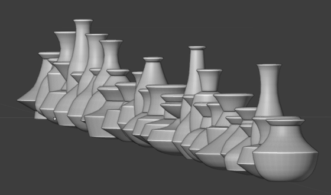

# Blender-Scripts
scripts and extensions for Blender

There's a gallery here:
http://peripheralarbor.com/gallery/v/CG+Art/scripts/

I like to develop each of these scripts as its own Blender file. Here's an overview:

## Crystal Tools
CrystalTools.py
Okay, so this one isn't its own Blender file. It should be though! There are/were some persistent bugs in it that I haven't been able to iron out. I keep hoping that Blender will allow python code as custom modifiers. Perhaps this is possible with Geometry Nodes, but that's still under heavy development, and seems to be a vertex shader wrapper anyway.
The script itself creates convex solids based on center-to-point plane definitions, or on existing faces (flattening and joining them). It's also possible to use adjacency pairs to do voronoi volume calculation, though the neighbor finding code is very inefficient (brute force N^N).

## Vase Generator
ProcgenVase.blend
What it says on the tin. Uses a base vertex chain template, randomizes the vertex locations, and applies a few modifiers for an easy-to-modify and lightweight vase model.

## Spaceship Generator
spaceship_generator.blend
A Bender Geometry Nodes setup for generating starships!

spaceship_generator_Boxy.blend
With another variation that does more long tall boxy ships.

## Bookshelf
ProcgenBookshelf.blend
A fun little recursive space-filling bookshelf thing.
Originally written to generate concepts for this book shelf: https://photos.app.goo.gl/GyDFPL5yJZh22F968

## Book
ProcgenBook.blend
This isn't actually a script at all yet! Just laying the groundwork for it so far. Shouldn't be too hard to do, though getting it to animate properly could be a real challenge. Something with dynamic vertex weights and an armature? We'll see.

## Deco Vines
Deco Vines.blend
I started this project to create decorative vines for a cabinet laser burning project I was working on. Remarkably flexible!

